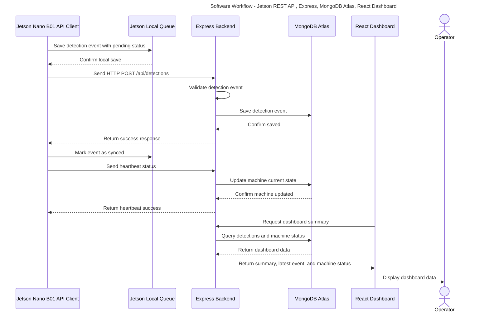

# Software & Dashboard Workflow — Robot phân loại rác thông minh

## 1. Mục tiêu tài liệu

Tài liệu này mô tả **workflow phần software/backend/dashboard** của hệ thống robot phân loại rác thông minh.

Phạm vi tài liệu này tập trung vào:

- Jetson Nano B01 gửi detection event qua Wi-Fi bằng HTTP REST API.
- Express Backend nhận và validate dữ liệu.
- MongoDB Atlas lưu detection events và machine status.
- React Dashboard local hiển thị dữ liệu phân loại và trạng thái robot.
- Cách tổ chức API, data model và luồng đồng bộ dữ liệu.

Tài liệu này không đi sâu vào sensor, servo/motor hoặc cơ cấu bàn nghiêng. Phần đó nằm trong file hardware workflow riêng.

---

## 2. Thành phần software chính

| Thành phần | Công nghệ | Vai trò |
|---|---|---|
| Edge API Client | Python service trên Jetson Nano B01 | Gửi detection event lên backend qua HTTP request |
| Local Queue | SQLite hoặc JSONL trên Jetson | Lưu event trước khi đồng bộ server |
| Backend API | Express.js | Nhận dữ liệu từ Jetson và cung cấp API cho dashboard |
| Database | MongoDB Atlas | Lưu detection events, machine status và heartbeat |
| Dashboard | React | Hiển thị thống kê, lịch sử và trạng thái machine |
| Network | Wi-Fi / LAN | Kết nối Jetson, backend và dashboard |

---

## 3. Software workflow tổng quan

```text
Jetson tạo detection event
   ↓
Lưu event vào local queue
   ↓
Jetson gửi HTTP POST qua Wi-Fi
   ↓
Express Backend nhận request
   ↓
Backend validate data
   ↓
Backend lưu vào MongoDB Atlas
   ↓
Backend trả response cho Jetson
   ↓
Jetson đánh dấu event đã synced
   ↓
React Dashboard gọi API
   ↓
Express Backend lấy data từ MongoDB Atlas
   ↓
Dashboard hiển thị lịch sử, thống kê và machine status
```

---

## 4. Input từ hardware workflow

Software workflow bắt đầu khi Jetson có một detection event sau một lượt phân loại.

Event chuẩn từ hardware/edge AI:

```json
{
  "eventId": "BK_BIN_01-20260527-000001",
  "machineId": "BK_BIN_01",
  "deviceModel": "Jetson Nano B01 + ESP32-S3 N16R8",
  "detectedType": "plastic_bottle",
  "confidence": 0.91,
  "targetBin": "bin_1",
  "sortCommand": "SORT_BIN_1",
  "sortingStatus": "success",
  "createdAt": "2026-05-27T11:30:00+07:00"
}
```

Ý nghĩa:

| Field | Ý nghĩa |
|---|---|
| eventId | ID duy nhất của lượt phân loại |
| machineId | ID của robot/prototype |
| deviceModel | Cấu hình phần cứng tạo ra event |
| detectedType | Loại rác/chai được AI xác định |
| confidence | Độ tin cậy của YOLOv8n |
| targetBin | Ngăn phân loại được chọn |
| sortCommand | Command đã gửi cho ESP32-S3 |
| sortingStatus | Trạng thái phân loại |
| createdAt | Thời điểm Jetson tạo event |

---

## 5. Workflow chi tiết theo giai đoạn

## Giai đoạn 1 — Jetson lưu event vào local queue

Mục tiêu:

Đảm bảo mỗi detection event được ghi nhận trước khi gửi lên backend.

Quy trình:

1. Jetson nhận event từ hardware workflow.
2. Jetson thêm field `syncStatus = pending`.
3. Jetson lưu event vào local queue.
4. Local queue xác nhận đã lưu.
5. Jetson chuyển event sang tiến trình sync server.

Local queue đề xuất:

```text
SQLite trên Jetson Nano B01
```

Bảng `detection_events` đề xuất:

```text
eventId
machineId
deviceModel
detectedType
confidence
targetBin
sortCommand
sortingStatus
syncStatus
createdAt
syncedAt
```

---

## Giai đoạn 2 — Jetson gửi HTTP POST đến Express Backend

Mục tiêu:

Đồng bộ detection event từ Jetson lên backend.

Quy trình:

1. Jetson lấy các event có `syncStatus = pending`.
2. Jetson tạo HTTP POST request.
3. Jetson gửi request qua Wi-Fi đến Express Backend.
4. Jetson chờ response từ backend.
5. Nếu backend trả `success = true`, Jetson cập nhật event local thành `syncStatus = synced`.

API:

```http
POST /api/detections
```

Request body:

```json
{
  "eventId": "BK_BIN_01-20260527-000001",
  "machineId": "BK_BIN_01",
  "deviceModel": "Jetson Nano B01 + ESP32-S3 N16R8",
  "detectedType": "plastic_bottle",
  "confidence": 0.91,
  "targetBin": "bin_1",
  "sortCommand": "SORT_BIN_1",
  "sortingStatus": "success",
  "createdAt": "2026-05-27T11:30:00+07:00"
}
```

Response body:

```json
{
  "success": true,
  "message": "Detection event saved",
  "eventId": "BK_BIN_01-20260527-000001"
}
```

Production-grade addition:

- Backend nên dùng `eventId` làm unique key.
- Nếu Jetson gửi lại cùng `eventId`, backend không tạo record trùng.
- Response vẫn nên trả success để Jetson có thể đánh dấu event là synced.

---

## Giai đoạn 3 — Express Backend validate dữ liệu

Mục tiêu:

Đảm bảo data từ robot đúng format trước khi lưu database.

Backend cần kiểm tra:

| Field | Rule |
|---|---|
| eventId | Bắt buộc, unique |
| machineId | Bắt buộc |
| deviceModel | Bắt buộc |
| detectedType | Nằm trong danh sách cho phép |
| confidence | Số từ 0 đến 1 |
| targetBin | Nằm trong danh sách bin hợp lệ |
| sortCommand | Nằm trong danh sách command hợp lệ |
| sortingStatus | `success`, `unknown`, hoặc `failed` |
| createdAt | Timestamp hợp lệ |

Danh sách enum MVP đề xuất:

```text
detectedType:
- plastic_bottle
- aluminum_can
- paper_carton
- unknown_object

targetBin:
- bin_1
- bin_2
- bin_3
- unknown_bin

sortCommand:
- SORT_BIN_1
- SORT_BIN_2
- SORT_BIN_3
- SORT_UNKNOWN

sortingStatus:
- success
- unknown
- failed
```

---

## Giai đoạn 4 — Backend lưu MongoDB Atlas

Mục tiêu:

Lưu detection event để dashboard và báo cáo có thể sử dụng.

Collection chính:

```text
detections
```

Document đề xuất:

```json
{
  "eventId": "BK_BIN_01-20260527-000001",
  "machineId": "BK_BIN_01",
  "deviceModel": "Jetson Nano B01 + ESP32-S3 N16R8",
  "detectedType": "plastic_bottle",
  "confidence": 0.91,
  "targetBin": "bin_1",
  "sortCommand": "SORT_BIN_1",
  "sortingStatus": "success",
  "createdAt": "2026-05-27T11:30:00+07:00",
  "serverReceivedAt": "2026-05-27T11:30:02+07:00"
}
```

Index đề xuất:

```text
unique index: eventId
normal index: machineId
normal index: createdAt
compound index: machineId + createdAt
```

---

## Giai đoạn 5 — Machine heartbeat

Mục tiêu:

Giúp dashboard biết robot còn online và đang ở trạng thái nào.

Jetson gửi heartbeat định kỳ lên backend.

API:

```http
POST /api/machines/heartbeat
```

Request body:

```json
{
  "machineId": "BK_BIN_01",
  "state": "IDLE",
  "lastEventId": "BK_BIN_01-20260527-000001",
  "createdAt": "2026-05-27T11:31:00+07:00"
}
```

Backend lưu hoặc cập nhật:

- `machines.currentState`
- `machines.lastSeenAt`
- `machine_heartbeats`

Dashboard dùng `lastSeenAt` để hiển thị trạng thái:

```text
Online / Offline / Idle / Sorting / Syncing
```

---

## Giai đoạn 6 — React Dashboard lấy dữ liệu

Mục tiêu:

Dashboard hiển thị thông tin cho nhóm hoặc người vận hành.

Quy trình:

1. React Dashboard gọi API đến Express Backend.
2. Backend query MongoDB Atlas.
3. Backend trả data cho React.
4. React render dashboard.

API dashboard tối thiểu:

```http
GET /api/detections?machineId=BK_BIN_01&limit=50
GET /api/detections/latest?machineId=BK_BIN_01
GET /api/stats/summary?machineId=BK_BIN_01
GET /api/machines/BK_BIN_01
```

---

## Giai đoạn 7 — Dashboard render UI

Dashboard MVP nên có 3 màn hình chính.

## 7.1. Dashboard Overview

Hiển thị:

- Tổng số lượt phân loại.
- Số lượng theo từng loại rác.
- Số lượng theo từng ngăn.
- Loại rác gần nhất.
- Confidence gần nhất.
- Trạng thái machine hiện tại.

---

## 7.2. Detection History

Hiển thị bảng lịch sử:

| Time | Type | Confidence | Target Bin | Status |
|---|---|---:|---|---|
| 2026-05-27 11:30 | plastic_bottle | 0.91 | bin_1 | success |

Có thể thêm filter:

- Theo loại rác.
- Theo ngày.
- Theo status.
- Theo machineId.

---

## 7.3. Machine Status

Hiển thị:

- Machine ID.
- Device model.
- Current state.
- Last seen time.
- Last event ID.
- Online/offline status.

---

## 6. API contract tổng hợp

## 6.1. API cho Jetson

| Method | Endpoint | Mục đích |
|---|---|---|
| POST | `/api/detections` | Jetson gửi detection event |
| POST | `/api/machines/heartbeat` | Jetson gửi heartbeat |

---

## 6.2. API cho React Dashboard

| Method | Endpoint | Mục đích |
|---|---|---|
| GET | `/api/detections` | Lấy lịch sử phân loại |
| GET | `/api/detections/latest` | Lấy event gần nhất |
| GET | `/api/stats/summary` | Lấy thống kê tổng quan |
| GET | `/api/machines/:machineId` | Lấy trạng thái machine |

---

## 7. MongoDB Atlas collections đề xuất

## 7.1. `detections`

Lưu từng lượt phân loại.

```json
{
  "eventId": "BK_BIN_01-20260527-000001",
  "machineId": "BK_BIN_01",
  "deviceModel": "Jetson Nano B01 + ESP32-S3 N16R8",
  "detectedType": "plastic_bottle",
  "confidence": 0.91,
  "targetBin": "bin_1",
  "sortCommand": "SORT_BIN_1",
  "sortingStatus": "success",
  "createdAt": "2026-05-27T11:30:00+07:00",
  "serverReceivedAt": "2026-05-27T11:30:02+07:00"
}
```

---

## 7.2. `machines`

Lưu thông tin hiện tại của máy.

```json
{
  "machineId": "BK_BIN_01",
  "name": "Smart Bin Prototype 01",
  "location": "Lab / Campus Demo",
  "hardware": {
    "edgeComputer": "Jetson Nano B01",
    "controller": "ESP32-S3 N16R8"
  },
  "currentState": "IDLE",
  "lastEventId": "BK_BIN_01-20260527-000001",
  "lastSeenAt": "2026-05-27T11:31:00+07:00"
}
```

---

## 7.3. `machine_heartbeats`

Lưu lịch sử heartbeat.

```json
{
  "machineId": "BK_BIN_01",
  "state": "IDLE",
  "lastEventId": "BK_BIN_01-20260527-000001",
  "createdAt": "2026-05-27T11:31:00+07:00"
}
```

---

## 8. Sequence diagram — software dashboard workflow



---

## 9. Frontend data flow trong React

```text
React App start
→ Load machine status
→ Load summary stats
→ Load latest detection
→ Load detection history
→ Render dashboard cards and table
→ Poll API mỗi vài giây hoặc refresh thủ công
```

MVP có thể dùng polling:

```text
setInterval gọi API mỗi 3–5 giây
```

Sau này có thể nâng cấp lên:

```text
WebSocket hoặc Server-Sent Events
```

---

## 10. Repo structure cho software

```text
smart-recycling-robot/
│
├── backend/
│   ├── src/
│   │   ├── app.js
│   │   ├── server.js
│   │   ├── routes/
│   │   │   ├── detection.routes.js
│   │   │   ├── machine.routes.js
│   │   │   └── stats.routes.js
│   │   ├── controllers/
│   │   │   ├── detection.controller.js
│   │   │   ├── machine.controller.js
│   │   │   └── stats.controller.js
│   │   ├── models/
│   │   │   ├── Detection.js
│   │   │   ├── Machine.js
│   │   │   └── MachineHeartbeat.js
│   │   └── config/
│   │       └── db.js
│   ├── package.json
│   └── .env.example
│
├── dashboard/
│   ├── src/
│   │   ├── api/
│   │   │   └── client.js
│   │   ├── components/
│   │   │   ├── SummaryCards.jsx
│   │   │   ├── DetectionTable.jsx
│   │   │   └── MachineStatus.jsx
│   │   ├── pages/
│   │   │   ├── Dashboard.jsx
│   │   │   ├── History.jsx
│   │   │   └── Machine.jsx
│   │   └── App.jsx
│   ├── package.json
│   └── .env.example
│
└── docs/
    ├── software-dashboard-workflow.md
    └── api-contract.md
```

---

## 11. Thứ tự build software đề xuất

```text
1. Tạo Express server cơ bản.
2. Kết nối MongoDB Atlas.
3. Tạo model Detection.
4. Tạo POST /api/detections.
5. Test POST bằng Postman/Bruno/REST Client.
6. Tạo GET /api/detections.
7. Tạo GET /api/detections/latest.
8. Tạo GET /api/stats/summary.
9. Tạo model Machine và MachineHeartbeat.
10. Tạo POST /api/machines/heartbeat.
11. Tạo React dashboard.
12. React gọi GET /api/detections.
13. React hiển thị bảng lịch sử.
14. React hiển thị summary cards.
15. React hiển thị machine status.
16. Ghép Jetson HTTP client với Express Backend.
```

---

## 12. Kết luận software workflow

Workflow software chuẩn của hệ thống:

```text
Jetson tạo detection event
→ Jetson lưu event vào local queue
→ Jetson gửi HTTP POST đến Express Backend
→ Backend validate event
→ Backend lưu MongoDB Atlas
→ Jetson đánh dấu event là synced
→ Jetson gửi heartbeat định kỳ
→ Dashboard gọi API lấy dữ liệu
→ React hiển thị lịch sử, thống kê và trạng thái robot
```

Cách chia này giúp phần mềm rõ ràng:

- Jetson API client là nơi gửi dữ liệu từ robot lên server.
- Express Backend là nơi validate và chuẩn hóa dữ liệu.
- MongoDB Atlas là nơi lưu lịch sử và trạng thái.
- React Dashboard là nơi hiển thị thông tin cho nhóm và người vận hành.
