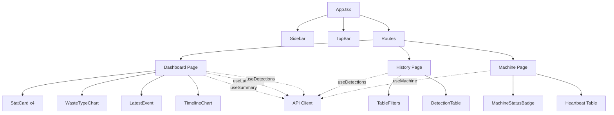

# GreenGuard Dashboard — Architecture Documentation

> **Last updated:** 2026-06-17  
> **Codebase path:** `Dashboard/`

---

## 1. Overview

The **GreenGuard Dashboard** is a monitoring and analytics platform for the GreenGuard Smart Recycling Robot. It receives real-time detection events and heartbeats from Jetson Nano edge devices (robots), stores them in MongoDB, and presents live operational data through a React dashboard.

| Layer    | Stack                                                            | Port |
| -------- | ---------------------------------------------------------------- | ---- |
| Backend  | Express 4 · TypeScript · MongoDB (Mongoose 8)                   | 3001 |
| Frontend | React 18 · Vite · TypeScript · TailwindCSS · React Query · Recharts | 5173 |

---

## 2. File Structure

```
Dashboard/
├── .gitignore
├── README.md
├── greenpoint_webapp_system_architecture.md  # System architecture document
├── App/
│   └── .env                                  # Legacy app env (contains only VITE_API_URL)
├── backend/
│   ├── .env.example                          # Environment template
│   ├── .gitignore
│   ├── package.json
│   ├── tsconfig.json
│   └── src/
│       ├── app.ts                            # Express app setup, middleware, route mounting
│       ├── server.ts                         # Bootstrap: dotenv, connect DB, start HTTP server
│       ├── config/
│       │   └── db.ts                         # Mongoose connection with error handling
│       ├── controllers/
│       │   ├── detection.controller.ts       # Detection CRUD handlers
│       │   ├── machine.controller.ts         # Machine heartbeat & status handlers
│       │   └── stats.controller.ts           # Summary statistics handler
│       ├── models/
│       │   ├── Detection.ts                  # Detection event Mongoose schema
│       │   ├── Machine.ts                    # Machine state Mongoose schema
│       │   └── MachineHeartbeat.ts           # Heartbeat log Mongoose schema
│       ├── routes/
│       │   ├── detection.routes.ts           # Detection endpoints
│       │   ├── machine.routes.ts             # Machine endpoints
│       │   └── stats.routes.ts               # Stats endpoints
│       └── types/
│           └── index.ts                      # Shared TypeScript types & DTOs
├── frontend/
│   ├── .env.example                          # VITE_API_BASE_URL, VITE_MACHINE_ID
│   ├── .gitignore
│   ├── index.html                            # HTML entry
│   ├── package.json
│   ├── pnpm-lock.yaml
│   ├── pnpm-workspace.yaml
│   ├── postcss.config.js                     # PostCSS config for TailwindCSS
│   ├── tailwind.config.js                    # TailwindCSS configuration
│   ├── tsconfig.json
│   ├── tsconfig.node.json
│   ├── vite.config.ts                        # Vite config with path aliases (@/ → src/)
│   ├── public/
│   │   └── images/                           # Static images for the dashboard
│   └── src/
│       ├── App.tsx                           # Root component with routing & layout
│       ├── main.tsx                          # React DOM render entry + QueryClientProvider
│       ├── index.css                         # TailwindCSS imports
│       ├── api/
│       │   └── client.ts                     # Axios instance + API functions
│       ├── components/
│       │   ├── cards/
│       │   │   ├── LatestEvent.tsx            # Latest detection event card
│       │   │   ├── MachineStatusBadge.tsx     # Online/offline status badge with indicator
│       │   │   └── StatCard.tsx              # Numeric stat display card
│       │   ├── charts/
│       │   │   ├── BinDistribution.tsx       # Bin distribution chart (Recharts)
│       │   │   ├── TimelineChart.tsx          # Detection timeline chart (Recharts)
│       │   │   └── WasteTypeChart.tsx         # Waste type breakdown chart (Recharts)
│       │   ├── layout/
│       │   │   ├── Sidebar.tsx               # Navigation sidebar
│       │   │   └── TopBar.tsx                # Top bar with page title
│       │   └── table/
│       │       ├── DetectionTable.tsx         # Detection history data table
│       │       └── TableFilters.tsx           # Filter controls for history page
│       ├── hooks/
│       │   ├── useDetections.ts              # React Query hook: paginated detection history
│       │   ├── useLatestEvent.ts             # React Query hook: latest detection (3s poll)
│       │   ├── useMachine.ts                 # React Query hook: machine status (5s poll)
│       │   └── useSummary.ts                 # React Query hook: summary stats (5s poll)
│       ├── pages/
│       │   ├── Dashboard.tsx                 # Main overview page with stats & charts
│       │   ├── History.tsx                   # Detection history with filters & pagination
│       │   └── Machine.tsx                   # Machine status & heartbeat log
│       ├── types/
│       │   └── index.ts                      # Frontend TypeScript types (mirrors backend)
│       └── utils/
│           ├── constants.ts                  # Machine ID, API URL, polling intervals, enums
│           ├── formatters.ts                 # Date/time, waste type, confidence, status formatters
│           └── mockData.ts                   # Demo/fallback data when backend is offline
└── docs/
    └── GreenGuard-Soft-Feat.md              # Feature documentation
```

---

## 3. Directory & File Responsibilities

### 3.1 `backend/src/config/`

| File    | Purpose |
| ------- | ------- |
| `db.ts` | Connects to MongoDB using `MONGODB_URI` from environment. Logs connection success or exits with error. |

### 3.2 `backend/src/types/`

| File       | Purpose |
| ---------- | ------- |
| `index.ts` | Central type definitions shared across models, controllers, and potentially frontend. Defines all DTOs, response shapes, and union types for the entire system. |

**Key Types:**

| Type               | Description |
| ------------------ | ----------- |
| `DetectedType`     | `'plastic_bottle' \| 'aluminum_can' \| 'paper_carton' \| 'unknown_object'` |
| `TargetBin`        | `'bin_1' \| 'bin_2' \| 'bin_3' \| 'unknown_bin'` |
| `SortCommand`      | `'SORT_BIN_1' \| 'SORT_BIN_2' \| 'SORT_BIN_3' \| 'SORT_UNKNOWN'` |
| `SortingStatus`    | `'success' \| 'failed' \| 'unknown'` |
| `MachineState`     | `'IDLE' \| 'SORTING' \| 'SYNCING' \| 'ERROR'` |
| `CreateDetectionDto` | Payload from Jetson for creating a detection event |
| `DetectionResponse`  | Detection with `serverReceivedAt` timestamp |
| `HeartbeatDto`       | Payload from Jetson for heartbeat reports |
| `MachineResponse`    | Machine info returned to dashboard |
| `SummaryResponse`    | Aggregated statistics response |
| `PaginatedResponse<T>` | Generic pagination wrapper |
| `ApiSuccess<T>`      | `{ success: true, message?, data? }` |
| `ApiError`           | `{ success: false, message, errors? }` |

### 3.3 `backend/src/models/`

| File                 | Purpose |
| -------------------- | ------- |
| `Detection.ts`       | Mongoose schema for detection events. Each document represents one waste classification by the robot. Indexed by `eventId` (unique), `machineId`, and compound `machineId + createdAt`. |
| `Machine.ts`         | Mongoose schema for machine state. One document per robot, upserted on heartbeat. Tracks `currentState`, `lastSeenAt`, hardware info. |
| `MachineHeartbeat.ts`| Append-only heartbeat log. Dashboard uses this for heartbeat history table. Indexed by `machineId`. |

### 3.4 `backend/src/controllers/`

| File                       | Purpose |
| -------------------------- | ------- |
| `detection.controller.ts`  | Handles detection event ingestion from Jetson (idempotent upsert by `eventId`), paginated history queries with filters, and latest-event polling. |
| `machine.controller.ts`    | Receives heartbeat from Jetson (upserts Machine + appends MachineHeartbeat), serves machine status with recent heartbeats. |
| `stats.controller.ts`      | Computes summary statistics via MongoDB aggregation: total count, breakdown by type/bin, average confidence, success rate. |

### 3.5 `backend/src/routes/`

| File                   | Purpose |
| ---------------------- | ------- |
| `detection.routes.ts`  | Maps detection endpoints: `POST /`, `GET /latest`, `GET /` |
| `machine.routes.ts`    | Maps machine endpoints: `POST /heartbeat`, `GET /:machineId` |
| `stats.routes.ts`      | Maps stats endpoint: `GET /summary` |

### 3.6 `frontend/src/api/`

| File        | Purpose |
| ----------- | ------- |
| `client.ts` | Axios instance configured with base URL and 8s timeout. Provides typed API functions: `fetchDetections`, `fetchLatestDetection`, `fetchSummary`, `fetchMachine`. All requests are scoped to the configured `MACHINE_ID`. Error interceptor logs but doesn't swallow errors. |

### 3.7 `frontend/src/hooks/`

Custom React Query hooks with polling:

| Hook              | Endpoint               | Poll Interval | Purpose |
| ----------------- | ---------------------- | ------------- | ------- |
| `useDetections`   | `GET /api/detections`  | 10s (or off)  | Paginated detection history with filters |
| `useLatestEvent`  | `GET /api/detections/latest` | 3s      | Most recent detection event |
| `useMachine`      | `GET /api/machines/:id`| 5s            | Machine status + recent heartbeats |
| `useSummary`      | `GET /api/stats/summary`| 5s           | Aggregated statistics |

### 3.8 `frontend/src/components/`

| Subdirectory | Components | Purpose |
| ------------ | ---------- | ------- |
| `cards/`     | `StatCard`, `LatestEvent`, `MachineStatusBadge` | Summary cards: numeric stats, latest event detail, machine online/offline badge with visual indicators |
| `charts/`    | `WasteTypeChart`, `TimelineChart`, `BinDistribution` | Recharts-based visualizations: waste type pie/bar, detection timeline, bin distribution |
| `layout/`    | `Sidebar`, `TopBar` | Application shell: navigation sidebar with route links, top bar with search/notifications |
| `table/`     | `DetectionTable`, `TableFilters` | Data table for detection history with type/status/date filters |

### 3.9 `frontend/src/pages/`

| Page           | Route      | Description |
| -------------- | ---------- | ----------- |
| `Dashboard.tsx` | `/`       | Main overview: stat cards (total, by type, confidence), waste type chart, latest event, detection timeline. Falls back to mock data when backend is unavailable. |
| `History.tsx`   | `/history` | Detection history with filter controls (type, status, date range), data table, pagination. |
| `Machine.tsx`   | `/machine` | Machine info (ID, name, location, hardware), current status badge, last heartbeat, recent heartbeat log table. |

### 3.10 `frontend/src/utils/`

| File            | Purpose |
| --------------- | ------- |
| `constants.ts`  | App-wide constants: `MACHINE_ID` (from env), `API_BASE_URL`, waste types/bins/statuses arrays, polling intervals, offline threshold (30s). |
| `formatters.ts` | Formatting functions: `formatTime` (Vietnam TZ), `formatTimeAgo` (relative), `formatWasteType`, `formatConfidence`, status labels, `isOnline` check. |
| `mockData.ts`   | Demo data arrays for when backend is offline — provides realistic detection events, summary stats, and machine state. |

---

## 4. Data Models (Mongoose Schemas)

### 4.1 Detection

```
Collection: detections
Fields:
  eventId            String    required, unique (idempotency key from Jetson)
  machineId          String    required, indexed
  deviceModel        String    required (e.g. "jetson_nano")
  detectedType       String    enum: ["plastic_bottle", "aluminum_can", "paper_carton", "unknown_object"]
  confidence         Number    required, 0-1
  targetBin          String    enum: ["bin_1", "bin_2", "bin_3", "unknown_bin"]
  sortCommand        String    enum: ["SORT_BIN_1", "SORT_BIN_2", "SORT_BIN_3", "SORT_UNKNOWN"]
  sortingStatus      String    enum: ["success", "failed", "unknown"]
  createdAt          Date      required (set by Jetson, not Mongoose timestamps)
  serverReceivedAt   Date      default: Date.now

Indexes:
  - eventId (unique)
  - machineId
  - { machineId: 1, createdAt: -1 } (compound, for timeline queries)

Timestamps: disabled (createdAt provided by Jetson)
```

### 4.2 Machine

```
Collection: machines
Fields:
  machineId      String     required, unique
  name           String     default: ""
  location       String     default: ""
  hardware {
    edgeComputer String     default: "" (e.g. "Jetson Nano 4GB")
    controller   String     default: "" (e.g. "ESP32-DevKitC")
  }
  currentState   String     enum: ["IDLE", "SORTING", "SYNCING", "ERROR"], default: "IDLE"
  lastEventId    String     default: null
  lastSeenAt     Date       default: null

Timestamps: { createdAt, updatedAt } (enabled)
```

### 4.3 MachineHeartbeat

```
Collection: machineheartbeats
Fields:
  machineId    String   required, indexed
  state        String   enum: ["IDLE", "SORTING", "SYNCING", "ERROR"], default: "IDLE"
  lastEventId  String   default: null
  createdAt    Date     required (set by Jetson)

Timestamps: disabled (append-only log, createdAt from Jetson)
```

---

## 5. API Reference (Swagger-Style)

**Base URL:** `http://localhost:3001`

### 5.1 Health Check

| Method | Endpoint  | Description |
| ------ | --------- | ----------- |
| GET    | `/health` | Server health check |

**Response `200`:**
```json
{ "status": "ok", "ts": "2026-06-17T00:00:00.000Z" }
```

---

### 5.2 Detections (`/api/detections`)

#### `POST /api/detections`

Ingest a detection event from the Jetson edge device. **Idempotent** — uses `eventId` as dedup key via upsert.

| Auth | Source |
| ---- | ------ |
| None | Jetson Nano edge device |

**Request Body (`CreateDetectionDto`):**
```json
{
  "eventId": "EVT-20260617-001",
  "machineId": "BK_BIN_01",
  "deviceModel": "jetson_nano",
  "detectedType": "plastic_bottle",
  "confidence": 0.94,
  "targetBin": "bin_1",
  "sortCommand": "SORT_BIN_1",
  "sortingStatus": "success",
  "createdAt": "2026-06-17T00:10:30.000Z"
}
```

| Field          | Type   | Required | Constraints |
| -------------- | ------ | -------- | ----------- |
| eventId        | string | ✅       | Unique per detection event |
| machineId      | string | ✅       | Robot identifier |
| deviceModel    | string | ✅       | Hardware model name |
| detectedType   | string | ✅       | `plastic_bottle \| aluminum_can \| paper_carton \| unknown_object` |
| confidence     | number | ✅       | `0.0 – 1.0` |
| targetBin      | string | ✅       | `bin_1 \| bin_2 \| bin_3 \| unknown_bin` |
| sortCommand    | string | ✅       | `SORT_BIN_1 \| SORT_BIN_2 \| SORT_BIN_3 \| SORT_UNKNOWN` |
| sortingStatus  | string | ✅       | `success \| failed \| unknown` |
| createdAt      | string | ✅       | ISO 8601 timestamp from Jetson |

**Response `201`:**
```json
{
  "success": true,
  "message": "Detection event saved",
  "eventId": "EVT-20260617-001"
}
```

**Response `500`:**
```json
{
  "success": false,
  "message": "Error description"
}
```

---

#### `GET /api/detections`

Retrieve detection history with optional filters and pagination.

| Auth | Source |
| ---- | ------ |
| None | Dashboard frontend |

**Query Parameters:**

| Param         | Type   | Default | Description |
| ------------- | ------ | ------- | ----------- |
| machineId     | string | —       | Filter by machine |
| detectedType  | string | —       | Filter by waste type |
| sortingStatus | string | —       | Filter by sorting result |
| startDate     | string | —       | ISO date, filter `createdAt >= startDate` |
| endDate       | string | —       | ISO date, filter `createdAt <= endDate` |
| limit         | number | 50      | Max results per page |
| offset        | number | 0       | Skip count for pagination |

**Response `200` (`PaginatedResponse<Detection>`):**
```json
{
  "data": [
    {
      "eventId": "EVT-20260617-001",
      "machineId": "BK_BIN_01",
      "deviceModel": "jetson_nano",
      "detectedType": "plastic_bottle",
      "confidence": 0.94,
      "targetBin": "bin_1",
      "sortCommand": "SORT_BIN_1",
      "sortingStatus": "success",
      "createdAt": "2026-06-17T00:10:30.000Z",
      "serverReceivedAt": "2026-06-17T00:10:31.000Z"
    }
  ],
  "total": 150,
  "limit": 50,
  "offset": 0
}
```

---

#### `GET /api/detections/latest`

Get the most recent detection event. Used by dashboard for live status display (polled every 3s).

| Auth | Source |
| ---- | ------ |
| None | Dashboard frontend |

**Query Parameters:**

| Param     | Type   | Description |
| --------- | ------ | ----------- |
| machineId | string | Filter by machine (optional) |

**Response `200`:** Single `Detection` object or `null`

```json
{
  "eventId": "EVT-20260617-042",
  "machineId": "BK_BIN_01",
  "detectedType": "aluminum_can",
  "confidence": 0.88,
  "targetBin": "bin_2",
  "sortCommand": "SORT_BIN_2",
  "sortingStatus": "success",
  "createdAt": "2026-06-17T00:09:55.000Z",
  "serverReceivedAt": "2026-06-17T00:09:56.000Z"
}
```

---

### 5.3 Machines (`/api/machines`)

#### `POST /api/machines/heartbeat`

Receive a heartbeat from the Jetson edge device. Upserts machine state and appends to heartbeat log.

| Auth | Source |
| ---- | ------ |
| None | Jetson Nano edge device |

**Request Body (`HeartbeatDto`):**
```json
{
  "machineId": "BK_BIN_01",
  "state": "IDLE",
  "lastEventId": "EVT-20260617-042",
  "createdAt": "2026-06-17T00:10:00.000Z"
}
```

| Field       | Type   | Required | Constraints |
| ----------- | ------ | -------- | ----------- |
| machineId   | string | ✅       | Robot identifier |
| state       | string | ✅       | `IDLE \| SORTING \| SYNCING \| ERROR` |
| lastEventId | string | ❌       | Most recent eventId processed |
| createdAt   | string | ✅       | ISO 8601 timestamp from Jetson |

**Response `200`:**
```json
{
  "success": true,
  "message": "Heartbeat recorded"
}
```

---

#### `GET /api/machines/:machineId`

Get machine status and recent heartbeat log. Used by dashboard Machine page (polled every 5s).

| Auth | Source |
| ---- | ------ |
| None | Dashboard frontend |

**Path Parameters:**

| Param     | Type   | Description |
| --------- | ------ | ----------- |
| machineId | string | Machine identifier |

**Response `200` (`MachineResponse` + heartbeats):**
```json
{
  "machineId": "BK_BIN_01",
  "name": "GreenGuard Robot #1",
  "location": "Canteen A - DHBK",
  "hardware": {
    "edgeComputer": "Jetson Nano 4GB",
    "controller": "ESP32-DevKitC"
  },
  "currentState": "IDLE",
  "lastEventId": "EVT-20260617-042",
  "lastSeenAt": "2026-06-17T00:10:00.000Z",
  "recentHeartbeats": [
    {
      "machineId": "BK_BIN_01",
      "state": "IDLE",
      "lastEventId": "EVT-20260617-042",
      "createdAt": "2026-06-17T00:10:00.000Z"
    }
  ]
}
```

**Response `404`:**
```json
{
  "success": false,
  "message": "Machine BK_BIN_01 not found"
}
```

---

### 5.4 Stats (`/api/stats`)

#### `GET /api/stats/summary`

Get aggregated summary statistics. Used by dashboard Overview page (polled every 5s).

| Auth | Source |
| ---- | ------ |
| None | Dashboard frontend |

**Query Parameters:**

| Param     | Type   | Description |
| --------- | ------ | ----------- |
| machineId | string | Filter by machine (optional, defaults to ALL) |

**Response `200` (`SummaryResponse`):**
```json
{
  "machineId": "BK_BIN_01",
  "total": 150,
  "byType": {
    "plastic_bottle": 80,
    "aluminum_can": 45,
    "paper_carton": 15,
    "unknown_object": 10
  },
  "byBin": {
    "bin_1": 80,
    "bin_2": 45,
    "bin_3": 15,
    "unknown_bin": 10
  },
  "avgConfidence": 0.91,
  "successRate": 0.95
}
```

---

## 6. Authentication & Authorization

The Dashboard backend currently operates **without authentication**. All endpoints are publicly accessible. This is designed for an internal monitoring use case where the Jetson devices and dashboard are on the same trusted network.

| Aspect | Detail |
| ------ | ------ |
| **Jetson → Backend** | No auth. Idempotent upserts via `eventId` prevent duplicates. |
| **Dashboard → Backend** | No auth. CORS is enabled globally. |

---

## 7. Environment Variables

### Backend (`.env`)

| Variable      | Type   | Default | Description |
| ------------- | ------ | ------- | ----------- |
| `PORT`        | number | 3001    | HTTP server port |
| `MONGODB_URI` | string | *required* | MongoDB connection string |
| `NODE_ENV`    | string | development | Runtime environment |

### Frontend (`.env`)

| Variable            | Type   | Default              | Description |
| ------------------- | ------ | -------------------- | ----------- |
| `VITE_API_BASE_URL` | string | http://localhost:3001 | Backend API base URL |
| `VITE_MACHINE_ID`   | string | BK_BIN_01            | Default machine to monitor |

---

## 8. Frontend Routes

| Path       | Page Component  | Description |
| ---------- | --------------- | ----------- |
| `/`        | `Dashboard.tsx`  | Main overview with live stats, charts, and latest event |
| `/history` | `History.tsx`    | Detection history table with filters & pagination |
| `/machine` | `Machine.tsx`    | Machine status, hardware info, heartbeat log |
| `*`        | → Redirect `/`  | Catch-all redirect to dashboard |

---

## 9. Polling & Real-time Strategy

The dashboard uses **short-polling** via React Query `refetchInterval` to keep data live:

| Data Source      | Interval | Hook              | Endpoint |
| ---------------- | -------- | ----------------- | -------- |
| Summary stats    | 5s       | `useSummary()`    | `GET /api/stats/summary` |
| Latest detection | 3s       | `useLatestEvent()`| `GET /api/detections/latest` |
| Machine status   | 5s       | `useMachine()`    | `GET /api/machines/:id` |
| Detection history| 10s      | `useDetections()` | `GET /api/detections` |

**Offline threshold:** Machine is considered offline if `lastSeenAt` is > 30 seconds ago.

**Fallback behavior:** All pages gracefully fall back to mock demo data when the backend is unreachable, displaying an amber "Demo data" badge.

---

## 10. Key Data Flows

### 10.1 Detection Event Flow

```
Robot classifies waste item
  → Jetson sends POST /api/detections { eventId, machineId, detectedType, ... }
    → Backend upserts Detection document (idempotent by eventId)
    → Dashboard polls GET /api/detections/latest every 3s
      → LatestEvent card updates in real-time
    → Dashboard polls GET /api/stats/summary every 5s
      → StatCards, WasteTypeChart update with new totals
```

### 10.2 Heartbeat Flow

```
Jetson sends periodic heartbeat
  → POST /api/machines/heartbeat { machineId, state, lastEventId }
    → Backend upserts Machine document (currentState, lastSeenAt)
    → Backend appends MachineHeartbeat log
  → Dashboard polls GET /api/machines/:id every 5s
    → MachineStatusBadge shows IDLE/SORTING/ERROR with online/offline indicator
    → Heartbeat table shows last 10 heartbeats
```

### 10.3 History Browsing Flow

```
User navigates to /history
  → useDetections hook fetches GET /api/detections?limit=20&offset=0
  → User applies filters (type, status, date range)
    → Hook re-fetches with filter params
  → User paginates (Prev/Next buttons)
    → Hook re-fetches with updated offset
  → Refresh button triggers manual refetch
```

---

## 11. Component Architecture



---

## 12. Technology Dependencies

### Backend

| Package    | Version | Purpose |
| ---------- | ------- | ------- |
| express    | 4.x     | HTTP framework |
| mongoose   | 8.x     | MongoDB ODM |
| cors       | 2.x     | Cross-origin resource sharing |
| dotenv     | 16.x   | Environment variable loading |
| tsx        | 4.x     | Dev-time TypeScript runner |

### Frontend

| Package                | Version | Purpose |
| ---------------------- | ------- | ------- |
| react                  | 18.x   | UI framework |
| react-router-dom       | 6.x    | Client-side routing |
| @tanstack/react-query  | 5.x    | Data fetching & caching with polling |
| axios                  | 1.x    | HTTP client |
| recharts               | 2.x    | Data visualization charts |
| tailwindcss            | 3.x    | Utility-first CSS framework |
| clsx                   | 2.x    | Conditional class names |
| vite                   | 5.x    | Build tooling |

---

## 13. Differences from App Codebase

| Aspect | Dashboard | App |
| ------ | --------- | --- |
| **Purpose** | IoT monitoring dashboard for robots | User-facing recycling rewards platform |
| **Backend architecture** | MVC (models → controllers → routes) | Modular (model → service → controller → validation → routes) |
| **Authentication** | None (internal tool) | JWT Bearer tokens with role-based access |
| **Validation** | No schema validation (TODO comments) | Zod schema validation middleware |
| **Data source** | Jetson Nano edge devices | Mobile app users + recycling machines |
| **Frontend data strategy** | React Query with short-polling | Direct API calls with Zustand state |
| **CSS framework** | TailwindCSS | Vanilla CSS |
| **Charts** | Recharts | None (data-driven UI) |
| **Package manager** | pnpm | npm |
