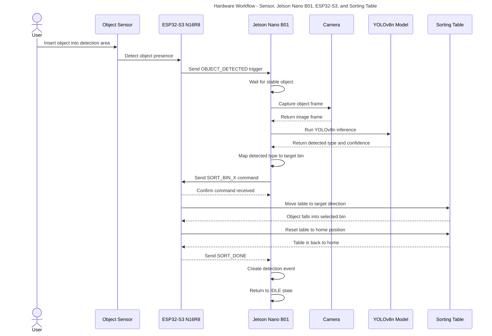

# Hardware Workflow — Robot phân loại rác thông minh

## 1. Mục tiêu tài liệu

Tài liệu này mô tả **workflow phần cứng/robot** của hệ thống phân loại rác thông minh.

Phạm vi tài liệu này tập trung vào:

- Sensor phát hiện vật thể.
- ESP32-S3 N16R8 xử lý realtime.
- Jetson Nano B01 điều phối camera và AI.
- YOLOv8n nhận diện loại rác.
- ESP32-S3 điều khiển bàn nghiêng.
- Robot tạo dữ liệu phân loại để bàn giao cho phần software/backend.

Tài liệu này **không đi sâu vào dashboard, MongoDB Atlas hoặc giao diện web**. Phần đó nằm trong file software workflow riêng.

---

## 2. Thành phần phần cứng chính

| Thành phần | Vai trò |
|---|---|
| Jetson Nano B01 | Edge computer, chạy camera, YOLOv8n, decision logic và tạo event phân loại |
| ESP32-S3 N16R8 | Hardware controller realtime, đọc sensor và điều khiển motor/servo |
| Object Sensor | Phát hiện có vật thể đi vào vùng nhận diện |
| Camera | Lấy hình ảnh vật thể cho Jetson xử lý |
| Servo/Motor | Điều khiển cơ cấu bàn nghiêng |
| Bàn nghiêng | Đưa rác/chai vào đúng ngăn phân loại |
| Power System | Cấp nguồn ổn định cho Jetson, ESP32-S3, sensor và motor |

---

## 3. Vai trò của từng bộ xử lý

## 3.1. ESP32-S3 N16R8

ESP32-S3 là bộ điều khiển realtime của hệ thống.

ESP32-S3 phụ trách:

- Đọc tín hiệu từ object sensor.
- Gửi trigger `OBJECT_DETECTED` cho Jetson Nano B01.
- Nhận command phân loại từ Jetson.
- Điều khiển servo/motor làm bàn nghiêng.
- Đưa bàn nghiêng về vị trí home sau mỗi lượt phân loại.
- Gửi trạng thái `READY`, `COMMAND_RECEIVED`, `SORT_DONE`, `TABLE_HOME` cho Jetson.

ESP32-S3 không chạy AI, không xử lý ảnh và không gửi HTTP request lên backend.

---

## 3.2. Jetson Nano B01

Jetson Nano B01 là bộ xử lý trung tâm ở tầng edge AI.

Jetson phụ trách:

- Nhận trigger từ ESP32-S3.
- Kích hoạt camera.
- Lấy frame hình ảnh.
- Chạy YOLOv8n để nhận diện vật thể.
- Kiểm tra confidence.
- Mapping loại rác sang ngăn phân loại.
- Gửi command phân loại cho ESP32-S3.
- Nhận trạng thái hoàn thành từ ESP32-S3.
- Tạo detection event cho lượt phân loại.
- Ghi event vào local queue để phần software/backend đồng bộ sau.

Jetson không nên trực tiếp điều khiển motor nếu đã có ESP32-S3. Jetson nên đóng vai trò “não xử lý AI”, còn ESP32-S3 đóng vai trò “tay chân realtime”.

---

## 4. Kiến trúc hardware tổng quan

```text
Người dùng
   ↓
Đưa vật thể vào vùng nhận diện
   ↓
Object Sensor
   ↓
ESP32-S3 N16R8
   ↓ USB Serial / UART
Jetson Nano B01
   ↓
Camera
   ↓
YOLOv8n Inference
   ↓
Decision Logic trên Jetson
   ↓ USB Serial / UART
ESP32-S3 N16R8
   ↓
Servo/Motor
   ↓
Bàn nghiêng
   ↓
Rác/chai rơi vào đúng ngăn
   ↓
Jetson tạo detection event
```

---

## 5. Workflow hardware tổng quát

```text
1. Robot khởi động.
2. ESP32-S3 kiểm tra sensor và đưa bàn nghiêng về home.
3. Jetson Nano B01 khởi động edge service.
4. Jetson mở kết nối Serial với ESP32-S3.
5. Jetson kiểm tra camera và load YOLOv8n.
6. ESP32-S3 gửi READY cho Jetson.
7. Robot chuyển sang trạng thái IDLE.
8. Người dùng đưa vật thể vào vùng nhận diện.
9. Object sensor phát hiện có vật thể.
10. ESP32-S3 gửi OBJECT_DETECTED cho Jetson.
11. Jetson đợi vật thể ổn định.
12. Jetson lấy hình ảnh từ camera.
13. Jetson chạy YOLOv8n.
14. Jetson mapping kết quả nhận diện sang target bin.
15. Jetson gửi SORT_BIN_X cho ESP32-S3.
16. ESP32-S3 điều khiển bàn nghiêng.
17. Bàn nghiêng đưa vật thể vào đúng ngăn.
18. ESP32-S3 đưa bàn nghiêng về home.
19. ESP32-S3 gửi SORT_DONE cho Jetson.
20. Jetson tạo detection event.
21. Robot quay lại trạng thái IDLE.
```

---

## 6. Workflow chi tiết theo giai đoạn

## Giai đoạn 0 — Boot và chuẩn bị hệ thống

Mục tiêu:

Đưa robot vào trạng thái sẵn sàng trước khi nhận vật thể.

Quy trình:

1. Cấp nguồn cho Jetson Nano B01 và ESP32-S3 N16R8.
2. ESP32-S3 khởi động firmware.
3. ESP32-S3 kiểm tra sensor.
4. ESP32-S3 điều khiển bàn nghiêng về vị trí home.
5. Jetson Nano B01 khởi động edge service.
6. Jetson mở camera.
7. Jetson load YOLOv8n model.
8. Jetson mở kết nối Serial với ESP32-S3.
9. ESP32-S3 gửi `READY` cho Jetson.
10. Jetson chuyển state sang `IDLE`.

Output:

```text
Robot đã sẵn sàng nhận vật thể mới.
```

---

## Giai đoạn 1 — Phát hiện vật thể

Mục tiêu:

Phát hiện khi người dùng đưa rác/chai vào vùng nhận diện.

Quy trình:

1. Robot đang ở state `IDLE`.
2. Người dùng đưa vật thể vào vùng nhận diện.
3. Object sensor phát hiện có vật thể.
4. ESP32-S3 đọc tín hiệu sensor.
5. ESP32-S3 gửi message `OBJECT_DETECTED` cho Jetson.
6. Jetson chuyển state sang `OBJECT_DETECTED`.

Lưu ý:

Sensor chỉ phát hiện **có vật thể**, không phát hiện được đó là chai, lon hay giấy. Việc nhận diện loại vật thể được thực hiện bởi camera và YOLOv8n trên Jetson.

---

## Giai đoạn 2 — Ổn định vật thể và lấy ảnh

Mục tiêu:

Đảm bảo vật thể đã nằm đúng vùng camera trước khi chạy AI.

Quy trình:

1. Jetson nhận `OBJECT_DETECTED`.
2. Jetson chuyển state sang `WAITING_FOR_STABLE_OBJECT`.
3. Jetson đợi một khoảng ngắn để vật thể ổn định.
4. Jetson chuyển state sang `CAPTURING_IMAGE`.
5. Camera lấy frame hiện tại.
6. Jetson lưu frame tạm để đưa vào YOLOv8n.

Output:

```text
Jetson có một frame hình ảnh để chạy AI inference.
```

---

## Giai đoạn 3 — Nhận diện bằng YOLOv8n

Mục tiêu:

Nhận diện loại vật thể dựa trên hình ảnh từ camera.

Quy trình:

1. Jetson chuyển state sang `RUNNING_INFERENCE`.
2. Jetson đưa frame vào YOLOv8n.
3. YOLOv8n trả về kết quả nhận diện.
4. Jetson chọn detection phù hợp nhất.
5. Jetson chuẩn hóa output thành `detectedType` và `confidence`.

Ví dụ output nội bộ:

```json
{
  "detectedType": "plastic_bottle",
  "confidence": 0.91
}
```

Lưu ý:

YOLOv8n chỉ nhận diện vật thể. YOLOv8n không điều khiển bàn nghiêng. Việc quyết định ngăn phân loại do decision logic trên Jetson thực hiện.

---

## Giai đoạn 4 — Quyết định ngăn phân loại

Mục tiêu:

Chuyển kết quả AI thành command cụ thể cho ESP32-S3.

Quy trình:

1. Jetson chuyển state sang `DECIDING_TARGET_BIN`.
2. Jetson kiểm tra confidence threshold.
3. Jetson xác định `finalType`.
4. Jetson mapping `finalType` sang `targetBin`.
5. Jetson mapping `targetBin` sang command cho ESP32-S3.

Ví dụ mapping:

```text
plastic_bottle  → bin_1       → SORT_BIN_1
aluminum_can    → bin_2       → SORT_BIN_2
paper_carton    → bin_3       → SORT_BIN_3
unknown_object  → unknown_bin → SORT_UNKNOWN
```

Ví dụ decision object:

```json
{
  "finalType": "plastic_bottle",
  "confidence": 0.91,
  "targetBin": "bin_1",
  "sortCommand": "SORT_BIN_1"
}
```

---

## Giai đoạn 5 — Gửi command cho ESP32-S3

Mục tiêu:

Jetson gửi lệnh phân loại cho ESP32-S3 để điều khiển cơ khí.

Quy trình:

1. Jetson chuyển state sang `SENDING_SORT_COMMAND`.
2. Jetson gửi command qua USB Serial/UART.
3. ESP32-S3 nhận command.
4. ESP32-S3 gửi `COMMAND_RECEIVED` cho Jetson.
5. Jetson chờ trạng thái hoàn thành từ ESP32-S3.

Ví dụ command:

```text
SORT_BIN_1
```

Ví dụ command dạng JSON mở rộng:

```json
{
  "commandId": "cmd-000001",
  "type": "SORT",
  "targetBin": "bin_1"
}
```

Khuyến nghị nội bộ:

- MVP có thể dùng text command đơn giản.
- Khi workflow ổn định, có thể chuyển sang JSON command để dễ mở rộng.

---

## Giai đoạn 6 — Điều khiển bàn nghiêng

Mục tiêu:

Đưa vật thể vào đúng ngăn phân loại.

Quy trình:

1. ESP32-S3 chuyển sang trạng thái điều khiển cơ khí.
2. ESP32-S3 điều khiển servo/motor theo command đã nhận.
3. Bàn nghiêng quay về hướng target bin.
4. Vật thể rơi vào ngăn tương ứng.
5. ESP32-S3 điều khiển bàn nghiêng quay về vị trí home.
6. ESP32-S3 gửi `TABLE_HOME` cho Jetson.
7. ESP32-S3 gửi `SORT_DONE` cho Jetson.

Output:

```text
Vật thể đã được đưa vào đúng ngăn và bàn nghiêng đã quay về home.
```

---

## Giai đoạn 7 — Tạo detection event trên Jetson

Mục tiêu:

Ghi nhận kết quả của lượt phân loại để software/backend có thể lưu trữ và hiển thị.

Quy trình:

1. Jetson nhận `SORT_DONE`.
2. Jetson chuyển state sang `CREATING_EVENT`.
3. Jetson tạo `eventId` duy nhất.
4. Jetson gộp thông tin AI, target bin, command và trạng thái phân loại.
5. Jetson tạo detection event chuẩn.
6. Jetson chuyển event sang local queue hoặc software sync layer.

Event data đề xuất:

```json
{
  "eventId": "BK_BIN_01-20260527-000001",
  "machineId": "BK_BIN_01",
  "deviceModel": "Jetson Nano B01 + ESP32-S3 N16R8",
  "detectedType": "plastic_bottle",
  "confidence": 0.91,
  "targetBin": "bin_1",
  "sortCommand": "SORT_BIN_1",
  "sortingStatus": "success",
  "createdAt": "2026-05-27T11:30:00+07:00"
}
```

---

## 7. State machine phần cứng

Robot nên được code theo state machine để các nhóm dễ thống nhất logic.

```text
BOOTING
READY
IDLE
OBJECT_DETECTED
WAITING_FOR_STABLE_OBJECT
CAPTURING_IMAGE
RUNNING_INFERENCE
DECIDING_TARGET_BIN
SENDING_SORT_COMMAND
SORTING
RESETTING_TABLE
CREATING_EVENT
BACK_TO_IDLE
```

| State | Ý nghĩa |
|---|---|
| BOOTING | Jetson và ESP32-S3 đang khởi động |
| READY | ESP32-S3 và Jetson đã sẵn sàng |
| IDLE | Robot đang chờ vật thể mới |
| OBJECT_DETECTED | ESP32-S3 báo có vật thể |
| WAITING_FOR_STABLE_OBJECT | Jetson đợi vật thể ổn định |
| CAPTURING_IMAGE | Jetson lấy frame từ camera |
| RUNNING_INFERENCE | Jetson chạy YOLOv8n |
| DECIDING_TARGET_BIN | Jetson chọn ngăn phân loại |
| SENDING_SORT_COMMAND | Jetson gửi command cho ESP32-S3 |
| SORTING | ESP32-S3 điều khiển bàn nghiêng |
| RESETTING_TABLE | ESP32-S3 đưa bàn nghiêng về home |
| CREATING_EVENT | Jetson tạo event phân loại |
| BACK_TO_IDLE | Robot quay lại trạng thái chờ |

---

## 8. Serial protocol Jetson Nano B01 ↔ ESP32-S3 N16R8

## 8.1. Connection

Kết nối đề xuất:

```text
USB Serial
```

Lý do:

- Dễ debug.
- Dễ dùng cho MVP sinh viên.
- Dễ xem message bằng Serial Monitor hoặc terminal.
- Tách rõ Jetson xử lý AI, ESP32-S3 xử lý realtime.

---

## 8.2. Message từ ESP32-S3 gửi lên Jetson

```text
READY
OBJECT_DETECTED
COMMAND_RECEIVED
TABLE_MOVING
TABLE_HOME
SORT_DONE
HEARTBEAT
```

---

## 8.3. Message từ Jetson gửi xuống ESP32-S3

```text
PING
SORT_BIN_1
SORT_BIN_2
SORT_BIN_3
SORT_UNKNOWN
RESET_TABLE
REQUEST_STATUS
```

---

## 8.4. Command mapping chuẩn

| detectedType | targetBin | command |
|---|---|---|
| plastic_bottle | bin_1 | SORT_BIN_1 |
| aluminum_can | bin_2 | SORT_BIN_2 |
| paper_carton | bin_3 | SORT_BIN_3 |
| unknown_object | unknown_bin | SORT_UNKNOWN |

---

## 9. Sequence diagram — hardware workflow



---

## 10. Output bàn giao cho phần software/backend

Sau khi một lượt phân loại hoàn tất, phần hardware/edge AI phải tạo được một detection event theo format thống nhất.

```json
{
  "eventId": "BK_BIN_01-20260527-000001",
  "machineId": "BK_BIN_01",
  "deviceModel": "Jetson Nano B01 + ESP32-S3 N16R8",
  "detectedType": "plastic_bottle",
  "confidence": 0.91,
  "targetBin": "bin_1",
  "sortCommand": "SORT_BIN_1",
  "sortingStatus": "success",
  "createdAt": "2026-05-27T11:30:00+07:00"
}
```

Đây là output chính để software workflow tiếp tục xử lý:

```text
Detection Event
→ Local Queue trên Jetson
→ HTTP POST đến Express Backend
→ MongoDB Atlas
→ React Dashboard
```

---

## 11. Checklist bàn giao giữa nhóm hardware và nhóm software

Nhóm hardware/edge AI cần bàn giao cho nhóm software:

- Danh sách `detectedType` hợp lệ.
- Danh sách `targetBin` hợp lệ.
- Danh sách `sortCommand` hợp lệ.
- Format detection event.
- `machineId` cố định của prototype.
- Cách tạo `eventId`.
- Thời điểm event được tạo.
- Cách Jetson lưu event vào local queue.

---

## 12. Kết luận hardware workflow

Workflow hardware chuẩn của robot:

```text
ESP32-S3 đọc object sensor
→ ESP32-S3 gửi OBJECT_DETECTED cho Jetson Nano B01
→ Jetson đợi vật thể ổn định
→ Jetson lấy frame từ camera
→ Jetson chạy YOLOv8n
→ Jetson mapping class sang target bin
→ Jetson gửi SORT_BIN_X cho ESP32-S3
→ ESP32-S3 điều khiển bàn nghiêng
→ Bàn nghiêng đưa vật thể vào đúng ngăn
→ ESP32-S3 reset bàn nghiêng về home
→ ESP32-S3 gửi SORT_DONE
→ Jetson tạo detection event
→ Robot quay lại IDLE
```

Cách chia này giúp phần cứng rõ ràng:

- ESP32-S3 N16R8 xử lý sensor và motor realtime.
- Jetson Nano B01 xử lý camera, YOLOv8n và quyết định phân loại.
- Detection event là điểm nối giữa hardware workflow và software dashboard workflow.
