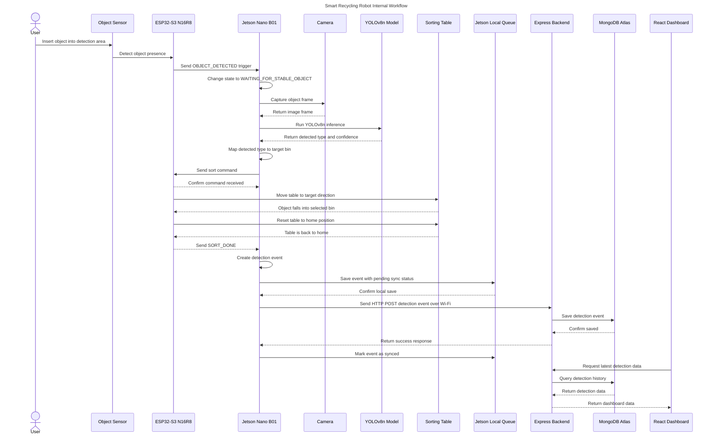

# Báo cáo nội bộ — Workflow hệ thống Robot phân loại rác thông minh

## 1. Mục tiêu tài liệu

Tài liệu này dùng để thống nhất workflow nội bộ cho dự án robot/thùng rác thông minh của nhóm.

Mục tiêu chính:

- Giúp các thành viên hiểu rõ luồng hoạt động từ lúc người dùng đưa rác vào đến lúc dữ liệu được lưu vào hệ thống.
- Làm rõ vai trò của từng phần cứng và phần mềm.
- Chuẩn hóa cách Jetson Nano B01 giao tiếp với ESP32-S3 N16R8.
- Chuẩn hóa dữ liệu gửi từ robot lên backend qua REST API.
- Làm nền tảng để chia việc cho các nhóm: AI, firmware, backend, dashboard và cơ khí.

Tài liệu này tập trung vào workflow vận hành chính của sản phẩm, không đi sâu vào danh sách rủi ro hay phân tích lỗi.

---

## 2. Phần cứng và phần mềm chính

## 2.1. Phần cứng chính

| Thành phần | Vai trò chính |
|---|---|
| Jetson Nano B01 | Máy tính edge xử lý camera, chạy YOLOv8n, quyết định phân loại, gửi dữ liệu lên server |
| ESP32-S3 N16R8 | Vi điều khiển realtime xử lý sensor, motor/servo, bàn nghiêng và giao tiếp với Jetson |
| Object Sensor | Phát hiện có vật thể đi vào vùng nhận diện |
| Camera | Lấy hình ảnh vật thể để Jetson xử lý bằng Computer Vision |
| Servo/Motor | Điều khiển cơ cấu bàn nghiêng |
| Bàn nghiêng | Đưa vật thể vào đúng ngăn phân loại |
| Wi-Fi module/network | Cho Jetson gửi HTTP request về backend |

## 2.2. Phần mềm chính

| Thành phần | Công nghệ đề xuất | Vai trò |
|---|---|---|
| AI inference | Python, OpenCV, YOLOv8n | Nhận diện loại rác/chai từ hình ảnh |
| Edge controller | Python service trên Jetson | Điều phối camera, AI, command, logging, API sync |
| Firmware | ESP-IDF hoặc Arduino/PlatformIO | Đọc sensor, điều khiển motor, phản hồi trạng thái |
| Backend | Express.js | Nhận REST API từ Jetson và cung cấp API cho dashboard |
| Database | MongoDB Atlas | Lưu lịch sử phân loại và trạng thái máy |
| Dashboard | React | Hiển thị dữ liệu phân loại và trạng thái hệ thống |

---

## 3. Nguyên tắc kiến trúc chung

## 3.1. Phân chia vai trò rõ ràng

Hệ thống nên chia thành 2 lớp xử lý chính:

### Jetson Nano B01 — Edge AI Controller

Jetson Nano B01 là bộ xử lý trung tâm ở tầng AI và dữ liệu.

Jetson phụ trách:

- Nhận trigger từ ESP32-S3.
- Kích hoạt camera.
- Lấy frame hình ảnh.
- Chạy YOLOv8n.
- Kiểm tra confidence.
- Mapping loại rác sang target bin.
- Gửi command phân loại cho ESP32-S3.
- Tạo event data.
- Lưu local queue.
- Gửi HTTP request qua Wi-Fi đến Express Backend.

### ESP32-S3 N16R8 — Realtime Hardware Controller

ESP32-S3 N16R8 phụ trách tầng realtime và cơ khí.

ESP32-S3 phụ trách:

- Đọc object sensor.
- Gửi tín hiệu `OBJECT_DETECTED` cho Jetson.
- Nhận command từ Jetson.
- Điều khiển servo/motor.
- Điều khiển bàn nghiêng.
- Đưa bàn nghiêng về vị trí home.
- Trả trạng thái hoàn thành cho Jetson.

## 3.2. Vì sao nên để sensor và motor đi qua ESP32-S3

Không nên để Jetson Nano xử lý trực tiếp toàn bộ sensor và motor.

Lý do:

- ESP32-S3 phù hợp hơn cho tác vụ realtime như đọc sensor và điều khiển servo/motor.
- Jetson nên tập trung vào camera, AI inference và xử lý dữ liệu.
- Khi tách rõ như vậy, workflow dễ debug, dễ chia việc và dễ mở rộng.
- Firmware và AI có thể được phát triển độc lập hơn.

---

## 4. Kiến trúc tổng quan

```text
Người dùng
   ↓
Object Sensor
   ↓
ESP32-S3 N16R8
   ↓ USB Serial / UART
Jetson Nano B01
   ↓
Camera + YOLOv8n
   ↓
Decision Logic
   ↓ USB Serial / UART
ESP32-S3 N16R8
   ↓
Bàn nghiêng / Motor
   ↓
Jetson tạo event data
   ↓
Local Queue trên Jetson
   ↓ Wi-Fi + HTTP REST API
Express Backend
   ↓
MongoDB Atlas
   ↓
React Dashboard
```

---

## 5. Workflow vận hành chính

## Giai đoạn 0 — Khởi động hệ thống

Mục tiêu:

Đưa toàn bộ hệ thống vào trạng thái sẵn sàng trước khi nhận vật thể.

Quy trình:

1. Jetson Nano B01 khởi động edge service.
2. Edge service load cấu hình hệ thống.
3. Edge service mở kết nối Serial với ESP32-S3.
4. Edge service kiểm tra camera.
5. Edge service load YOLOv8n model.
6. Edge service kiểm tra local queue.
7. ESP32-S3 khởi động firmware.
8. ESP32-S3 đưa bàn nghiêng về vị trí home.
9. ESP32-S3 gửi trạng thái `READY` cho Jetson.
10. Jetson chuyển robot sang trạng thái `IDLE`.

Output của giai đoạn:

```text
Robot sẵn sàng nhận vật thể mới.
```

---

## Giai đoạn 1 — Phát hiện vật thể

Mục tiêu:

Phát hiện khi người dùng đưa chai/rác vào vùng nhận diện.

Quy trình:

1. Robot đang ở trạng thái `IDLE`.
2. Người dùng đưa vật thể vào vùng nhận diện.
3. Object sensor phát hiện có vật thể.
4. ESP32-S3 nhận tín hiệu từ sensor.
5. ESP32-S3 gửi message `OBJECT_DETECTED` cho Jetson qua Serial.
6. Jetson chuyển trạng thái sang `OBJECT_DETECTED`.

Lưu ý nội bộ:

Sensor chỉ phát hiện có vật thể. Sensor không xác định được đó là chai, lon hay loại rác nào. Việc nhận diện loại rác thuộc về camera và YOLOv8n.

---

## Giai đoạn 2 — Ổn định vật thể và lấy hình ảnh

Mục tiêu:

Đảm bảo vật thể đã nằm trong vùng camera trước khi chạy AI.

Quy trình:

1. Jetson nhận message `OBJECT_DETECTED`.
2. Jetson chuyển trạng thái sang `WAITING_FOR_STABLE_OBJECT`.
3. Jetson đợi một khoảng ngắn để vật thể ổn định.
4. Jetson chuyển trạng thái sang `CAPTURING_IMAGE`.
5. Camera lấy frame hiện tại.
6. Jetson lưu frame tạm thời để đưa vào YOLOv8n.

Output của giai đoạn:

```text
Jetson có một frame hình ảnh hợp lệ để chạy AI.
```

---

## Giai đoạn 3 — Nhận diện bằng YOLOv8n

Mục tiêu:

Dùng model YOLOv8n để nhận diện loại vật thể.

Quy trình:

1. Jetson chuyển trạng thái sang `RUNNING_INFERENCE`.
2. Jetson đưa frame vào YOLOv8n model.
3. YOLOv8n trả về danh sách detection.
4. Jetson lấy detection có confidence cao nhất.
5. Jetson chuẩn hóa output thành dạng nội bộ.

Ví dụ output nội bộ:

```json
{
  "detectedType": "plastic_bottle",
  "confidence": 0.91
}
```

Lưu ý nội bộ:

YOLOv8n chỉ trả về kết quả nhận diện. YOLOv8n không điều khiển bàn nghiêng và không quyết định trực tiếp vật thể đi vào ngăn nào.

---

## Giai đoạn 4 — Quyết định ngăn phân loại

Mục tiêu:

Chuyển kết quả AI thành command cụ thể cho ESP32-S3.

Quy trình:

1. Jetson chuyển trạng thái sang `DECIDING_TARGET_BIN`.
2. Jetson kiểm tra confidence threshold.
3. Jetson xác định `finalType`.
4. Jetson mapping `finalType` sang `targetBin`.
5. Jetson mapping `targetBin` sang command cho ESP32-S3.

Ví dụ mapping:

```text
plastic_bottle  → bin_1       → SORT_BIN_1
aluminum_can    → bin_2       → SORT_BIN_2
paper_carton    → bin_3       → SORT_BIN_3
unknown_object  → unknown_bin → SORT_UNKNOWN
```

Ví dụ decision object:

```json
{
  "finalType": "plastic_bottle",
  "confidence": 0.91,
  "targetBin": "bin_1",
  "sortCommand": "SORT_BIN_1"
}
```

---

## Giai đoạn 5 — Điều khiển bàn nghiêng

Mục tiêu:

Đưa vật thể vào đúng ngăn bằng cơ cấu bàn nghiêng.

Quy trình:

1. Jetson gửi command phân loại cho ESP32-S3 qua Serial.
2. ESP32-S3 xác nhận đã nhận command.
3. ESP32-S3 điều khiển servo/motor.
4. Bàn nghiêng quay về hướng tương ứng với ngăn phân loại.
5. Vật thể rơi vào ngăn.
6. ESP32-S3 đưa bàn nghiêng về vị trí home.
7. ESP32-S3 gửi `SORT_DONE` cho Jetson.
8. Jetson chuyển trạng thái sang `LOGGING_LOCAL_DATA`.

Ví dụ command flow:

```text
Jetson  → ESP32-S3: SORT_BIN_1
ESP32-S3 → Jetson: COMMAND_RECEIVED
ESP32-S3 → Jetson: TABLE_MOVING
ESP32-S3 → Jetson: TABLE_HOME
ESP32-S3 → Jetson: SORT_DONE
```

---

## Giai đoạn 6 — Tạo event data cho lượt phân loại

Mục tiêu:

Mỗi lần phân loại phải tạo ra một event rõ ràng để lưu trữ và thống kê.

Quy trình:

1. Jetson tạo `eventId` duy nhất cho lượt phân loại.
2. Jetson gộp dữ liệu AI, dữ liệu command và trạng thái phân loại.
3. Jetson thêm timestamp theo thời gian local của thiết bị.
4. Jetson tạo record chuẩn để lưu local và gửi backend.

Event data đề xuất:

```json
{
  "eventId": "BK_BIN_01-20260527-000001",
  "machineId": "BK_BIN_01",
  "deviceModel": "Jetson Nano B01 + ESP32-S3 N16R8",
  "detectedType": "plastic_bottle",
  "confidence": 0.91,
  "targetBin": "bin_1",
  "sortCommand": "SORT_BIN_1",
  "sortingStatus": "success",
  "syncStatus": "pending",
  "createdAt": "2026-05-27T11:30:00+07:00"
}
```

Production-grade addition:

- Nên có `eventId` để backend tránh lưu trùng dữ liệu nếu Jetson gửi lại cùng một event.
- Nên có `machineId` để sau này nhiều máy vẫn dùng chung backend.
- Nên có `deviceModel` để biết record đến từ cấu hình phần cứng nào.

---

## Giai đoạn 7 — Lưu local queue trên Jetson

Mục tiêu:

Đảm bảo dữ liệu mỗi lượt phân loại được ghi nhận trước khi gửi server.

Quy trình:

1. Jetson lưu event vào local queue.
2. Event được đánh dấu `syncStatus = pending`.
3. Jetson chuyển sang bước đồng bộ server.

Local queue đề xuất:

```text
SQLite local database trên Jetson Nano B01
```

Bảng local đề xuất:

```text
detection_events
- eventId
- machineId
- detectedType
- confidence
- targetBin
- sortCommand
- sortingStatus
- syncStatus
- createdAt
- syncedAt
```

---

## Giai đoạn 8 — Gửi HTTP request qua Wi-Fi đến Express Backend

Mục tiêu:

Đồng bộ dữ liệu từ Jetson Nano B01 lên backend.

Quy trình:

1. Jetson lấy các event có `syncStatus = pending`.
2. Jetson gửi HTTP POST request đến Express Backend.
3. Express Backend validate dữ liệu.
4. Express Backend lưu vào MongoDB Atlas.
5. Express Backend trả response cho Jetson.
6. Jetson cập nhật local record thành `syncStatus = synced`.

API chính:

```http
POST /api/detections
```

Request body:

```json
{
  "eventId": "BK_BIN_01-20260527-000001",
  "machineId": "BK_BIN_01",
  "deviceModel": "Jetson Nano B01 + ESP32-S3 N16R8",
  "detectedType": "plastic_bottle",
  "confidence": 0.91,
  "targetBin": "bin_1",
  "sortCommand": "SORT_BIN_1",
  "sortingStatus": "success",
  "createdAt": "2026-05-27T11:30:00+07:00"
}
```

Response body:

```json
{
  "success": true,
  "message": "Detection event saved",
  "eventId": "BK_BIN_01-20260527-000001"
}
```

Production-grade addition:

Backend nên xử lý `eventId` theo hướng idempotent. Nếu Jetson gửi lại cùng `eventId`, backend không tạo record trùng.

---

## Giai đoạn 9 — Lưu dữ liệu vào MongoDB Atlas

Mục tiêu:

Lưu event phân loại vào database để dashboard và báo cáo có thể sử dụng.

Collection chính:

```text
detections
```

Document đề xuất:

```json
{
  "eventId": "BK_BIN_01-20260527-000001",
  "machineId": "BK_BIN_01",
  "deviceModel": "Jetson Nano B01 + ESP32-S3 N16R8",
  "detectedType": "plastic_bottle",
  "confidence": 0.91,
  "targetBin": "bin_1",
  "sortCommand": "SORT_BIN_1",
  "sortingStatus": "success",
  "createdAt": "2026-05-27T11:30:00+07:00",
  "serverReceivedAt": "2026-05-27T11:30:02+07:00"
}
```

Index đề xuất:

```text
unique index: eventId
normal index: machineId
normal index: createdAt
compound index: machineId + createdAt
```

---

## Giai đoạn 10 — Dashboard React hiển thị dữ liệu

Mục tiêu:

Cho phép nhóm kiểm tra dữ liệu vận hành của robot bằng giao diện local web app.

Quy trình:

1. React Dashboard gọi API đến Express Backend.
2. Express Backend lấy dữ liệu từ MongoDB Atlas.
3. Backend trả dữ liệu cho React.
4. Dashboard hiển thị thống kê và lịch sử phân loại.

API tối thiểu cho dashboard:

```http
GET /api/detections
GET /api/detections/latest
GET /api/stats/summary
```

Dashboard MVP nên hiển thị:

- Tổng số lượt phân loại.
- Loại rác gần nhất.
- Confidence gần nhất.
- Số lượng theo từng loại rác.
- Số lượng theo từng ngăn.
- Lịch sử phân loại gần đây.
- Trạng thái machine online/offline.

---

## 6. State machine đề xuất

Để các thành viên dễ thống nhất code, robot nên được viết theo state machine.

```text
BOOTING
READY
IDLE
OBJECT_DETECTED
WAITING_FOR_STABLE_OBJECT
CAPTURING_IMAGE
RUNNING_INFERENCE
DECIDING_TARGET_BIN
SENDING_SORT_COMMAND
SORTING
RESETTING_TABLE
CREATING_EVENT
SAVING_LOCAL
SYNCING_TO_SERVER
BACK_TO_IDLE
```

Ý nghĩa:

| State | Ý nghĩa |
|---|---|
| BOOTING | Jetson và ESP32 đang khởi động |
| READY | Hệ thống đã sẵn sàng |
| IDLE | Robot đang chờ vật thể |
| OBJECT_DETECTED | ESP32 báo có vật thể |
| WAITING_FOR_STABLE_OBJECT | Jetson đợi vật thể ổn định |
| CAPTURING_IMAGE | Jetson lấy hình từ camera |
| RUNNING_INFERENCE | Jetson chạy YOLOv8n |
| DECIDING_TARGET_BIN | Jetson quyết định ngăn phân loại |
| SENDING_SORT_COMMAND | Jetson gửi command cho ESP32 |
| SORTING | ESP32 điều khiển bàn nghiêng |
| RESETTING_TABLE | ESP32 đưa bàn nghiêng về home |
| CREATING_EVENT | Jetson tạo event data |
| SAVING_LOCAL | Jetson lưu event vào local queue |
| SYNCING_TO_SERVER | Jetson gửi event lên Express Backend |
| BACK_TO_IDLE | Robot quay lại trạng thái chờ |

---

## 7. Chuẩn giao tiếp Jetson Nano B01 ↔ ESP32-S3 N16R8

## 7.1. Connection đề xuất

Kết nối nội bộ giữa Jetson và ESP32-S3:

```text
USB Serial
```

Lý do:

- Dễ debug.
- Dễ dùng trong dự án sinh viên.
- Có thể monitor message bằng serial terminal.
- Tách rõ Jetson xử lý AI, ESP32-S3 xử lý realtime.

## 7.2. Message từ ESP32-S3 gửi lên Jetson

```text
READY
OBJECT_DETECTED
COMMAND_RECEIVED
TABLE_MOVING
TABLE_HOME
SORT_DONE
HEARTBEAT
```

## 7.3. Message từ Jetson gửi xuống ESP32-S3

```text
PING
SORT_BIN_1
SORT_BIN_2
SORT_BIN_3
SORT_UNKNOWN
RESET_TABLE
REQUEST_STATUS
```

## 7.4. Format message đề xuất

Bản đơn giản:

```text
SORT_BIN_1
```

Bản chuẩn hơn:

```json
{
  "commandId": "cmd-000001",
  "type": "SORT",
  "targetBin": "bin_1"
}
```

Khuyến nghị:

- MVP có thể dùng text command đơn giản.
- Khi hệ thống ổn, chuyển sang JSON message để dễ mở rộng.

---

## 8. REST API contract giữa Jetson và Express Backend

## 8.1. POST /api/detections

Dùng để Jetson gửi event phân loại lên backend.

Request:

```json
{
  "eventId": "BK_BIN_01-20260527-000001",
  "machineId": "BK_BIN_01",
  "deviceModel": "Jetson Nano B01 + ESP32-S3 N16R8",
  "detectedType": "plastic_bottle",
  "confidence": 0.91,
  "targetBin": "bin_1",
  "sortCommand": "SORT_BIN_1",
  "sortingStatus": "success",
  "createdAt": "2026-05-27T11:30:00+07:00"
}
```

Response:

```json
{
  "success": true,
  "message": "Detection event saved",
  "eventId": "BK_BIN_01-20260527-000001"
}
```

## 8.2. GET /api/detections

Dùng để dashboard lấy lịch sử phân loại.

Query gợi ý:

```http
GET /api/detections?machineId=BK_BIN_01&limit=50
```

## 8.3. GET /api/detections/latest

Dùng để dashboard lấy event gần nhất.

```http
GET /api/detections/latest?machineId=BK_BIN_01
```

## 8.4. POST /api/machines/heartbeat

Dùng để Jetson báo rằng robot vẫn đang online.

Request:

```json
{
  "machineId": "BK_BIN_01",
  "state": "IDLE",
  "lastEventId": "BK_BIN_01-20260527-000001",
  "createdAt": "2026-05-27T11:31:00+07:00"
}
```

Production-grade addition:

Heartbeat giúp dashboard biết robot còn online hay không, kể cả khi chưa có lượt phân loại mới.

---

## 9. MongoDB Atlas collections đề xuất

## 9.1. detections

Lưu từng lượt phân loại.

```json
{
  "eventId": "BK_BIN_01-20260527-000001",
  "machineId": "BK_BIN_01",
  "deviceModel": "Jetson Nano B01 + ESP32-S3 N16R8",
  "detectedType": "plastic_bottle",
  "confidence": 0.91,
  "targetBin": "bin_1",
  "sortCommand": "SORT_BIN_1",
  "sortingStatus": "success",
  "createdAt": "2026-05-27T11:30:00+07:00",
  "serverReceivedAt": "2026-05-27T11:30:02+07:00"
}
```

## 9.2. machines

Lưu thông tin máy.

```json
{
  "machineId": "BK_BIN_01",
  "name": "Smart Bin Prototype 01",
  "location": "Lab / Campus Demo",
  "hardware": {
    "edgeComputer": "Jetson Nano B01",
    "controller": "ESP32-S3 N16R8"
  },
  "currentState": "IDLE",
  "lastSeenAt": "2026-05-27T11:31:00+07:00"
}
```

## 9.3. machine_heartbeats

Lưu heartbeat theo thời gian.

```json
{
  "machineId": "BK_BIN_01",
  "state": "IDLE",
  "lastEventId": "BK_BIN_01-20260527-000001",
  "createdAt": "2026-05-27T11:31:00+07:00"
}
```

---

## 10. Sequence diagram — workflow chính



---

## 11. Workflow rút gọn cho thành viên mới

```text
1. ESP32-S3 đọc sensor.
2. Sensor phát hiện có vật thể.
3. ESP32-S3 gửi OBJECT_DETECTED cho Jetson.
4. Jetson đợi vật thể ổn định.
5. Jetson lấy ảnh từ camera.
6. Jetson chạy YOLOv8n.
7. YOLO trả loại rác và confidence.
8. Jetson mapping loại rác sang ngăn phân loại.
9. Jetson gửi SORT_BIN_X cho ESP32-S3.
10. ESP32-S3 điều khiển bàn nghiêng.
11. Bàn nghiêng đưa rác vào đúng ngăn.
12. ESP32-S3 đưa bàn nghiêng về home.
13. ESP32-S3 gửi SORT_DONE cho Jetson.
14. Jetson tạo detection event.
15. Jetson lưu event vào local queue.
16. Jetson gửi HTTP POST qua Wi-Fi đến Express Backend.
17. Backend lưu event vào MongoDB Atlas.
18. Dashboard React lấy dữ liệu từ backend và hiển thị.
```

---

## 12. Chia việc teamwork

## 12.1. Nhóm Firmware + Cơ khí

Phụ trách:

- ESP32-S3 N16R8 firmware.
- Đọc object sensor.
- Điều khiển servo/motor.
- Điều khiển bàn nghiêng.
- Reset bàn nghiêng về home.
- Giao tiếp Serial với Jetson.

Output cần bàn giao:

```text
READY
OBJECT_DETECTED
COMMAND_RECEIVED
SORT_DONE
TABLE_HOME
```

---

## 12.2. Nhóm Jetson + AI

Phụ trách:

- Cài môi trường Jetson Nano B01.
- Kết nối camera.
- Chạy YOLOv8n inference.
- Viết decision logic.
- Giao tiếp Serial với ESP32-S3.
- Tạo local queue.
- Gửi HTTP request đến backend.

Output cần bàn giao:

```json
{
  "eventId": "BK_BIN_01-20260527-000001",
  "machineId": "BK_BIN_01",
  "detectedType": "plastic_bottle",
  "confidence": 0.91,
  "targetBin": "bin_1",
  "sortingStatus": "success"
}
```

---

## 12.3. Nhóm Backend

Phụ trách:

- Express.js server.
- MongoDB Atlas connection.
- API validation.
- API cho Jetson.
- API cho React Dashboard.
- Idempotency theo `eventId`.

API cần bàn giao:

```text
POST /api/detections
GET /api/detections
GET /api/detections/latest
GET /api/stats/summary
POST /api/machines/heartbeat
```

---

## 12.4. Nhóm Dashboard

Phụ trách:

- React dashboard.
- Hiển thị dữ liệu phân loại.
- Hiển thị thống kê.
- Hiển thị trạng thái machine.
- Gọi API từ Express Backend.

Màn hình MVP:

```text
Dashboard Overview
Detection History
Machine Status
```

---

## 13. Thứ tự build nội bộ đề xuất

```text
1. Firmware ESP32-S3 đọc sensor và in OBJECT_DETECTED ra Serial.
2. Jetson đọc được message OBJECT_DETECTED từ ESP32-S3.
3. Jetson mở camera và lấy frame.
4. Jetson chạy YOLOv8n trên frame.
5. Jetson mapping class sang target bin.
6. Jetson gửi SORT_BIN_X cho ESP32-S3.
7. ESP32-S3 điều khiển bàn nghiêng và trả SORT_DONE.
8. Jetson tạo detection event.
9. Jetson lưu event vào SQLite local queue.
10. Express tạo POST /api/detections.
11. Express lưu event vào MongoDB Atlas.
12. Jetson gửi HTTP POST thành công.
13. React dashboard gọi GET /api/detections.
14. React hiển thị lịch sử phân loại.
15. Thêm heartbeat để dashboard biết machine đang online.
16. Ghép toàn bộ flow end-to-end.
```

---

## 14. Repo structure đề xuất

```text
smart-recycling-robot/
│
├── ai-edge/
│   ├── main.py
│   ├── camera.py
│   ├── detector.py
│   ├── decision.py
│   ├── serial_client.py
│   ├── api_client.py
│   ├── local_queue.py
│   ├── config.yaml
│   └── requirements.txt
│
├── firmware/
│   └── esp32-s3-controller/
│       ├── src/
│       ├── include/
│       └── platformio.ini
│
├── backend/
│   ├── src/
│   ├── models/
│   ├── routes/
│   ├── controllers/
│   ├── package.json
│   └── .env.example
│
├── dashboard/
│   ├── src/
│   ├── components/
│   ├── pages/
│   └── package.json
│
├── docs/
│   ├── internal-workflow-report.md
│   ├── api-contract.md
│   ├── serial-protocol.md
│   └── sequence-diagram.md
│
└── README.md
```

---

## 15. Kết luận nội bộ

Workflow chuẩn của hệ thống nên được hiểu là:

```text
ESP32-S3 phát hiện vật thể bằng sensor
→ ESP32-S3 gửi trigger cho Jetson Nano B01
→ Jetson kích hoạt camera
→ Jetson chạy YOLOv8n
→ Jetson quyết định target bin
→ Jetson gửi command cho ESP32-S3
→ ESP32-S3 điều khiển bàn nghiêng
→ ESP32-S3 báo hoàn thành
→ Jetson tạo detection event
→ Jetson lưu local queue
→ Jetson gửi HTTP request qua Wi-Fi đến Express Backend
→ Backend lưu MongoDB Atlas
→ React Dashboard hiển thị dữ liệu
```

Cách chia này giúp hệ thống rõ ràng hơn:

- ESP32-S3 là controller realtime cho sensor và motor.
- Jetson Nano B01 là bộ xử lý AI và dữ liệu.
- Express Backend là nơi nhận và chuẩn hóa dữ liệu.
- MongoDB Atlas là nơi lưu trữ lịch sử.
- React Dashboard là nơi hiển thị thông tin cho nhóm và người vận hành.

Đây là cấu trúc phù hợp cho MVP sinh viên nhưng vẫn đủ nền tảng để phát triển theo hướng production-grade sau này.
